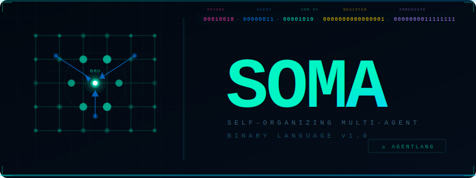

<p align="center">
  
</p>


# SOMA 🧠


**Self-Organizing Multi-Agent Binary Language**

> *A new binary programming language built from the ground up for SOM neural topology, multi-agent coordination, and autonomous OS-level execution — on any substrate.*

---

## What is SOMA?

SOMA is not a framework. It is not a library. It is a **new programming language** — with its own binary format, grammar, instruction set, assembler, and standard library — designed to treat agents and self-organizing maps as **hardware primitives**, not abstractions.

Where other languages (Python, Rust, Go) bolt agent systems on top as libraries, SOMA builds them into the **instruction word itself**.

Every 64-bit instruction in SOMA encodes:
- **Who** executes it (Agent ID)
- **Where** on the SOM topology (X, Y coordinate)
- **What** to do (opcode)
- **With what** (register + immediate)

---

## Architecture

```
┌─────────────────────────────────────────┐
│         USER PROGRAMS (.soma)           │
├──────────┬──────────┬───────────────────┤
│ AGENT_A  │ AGENT_B  │ AGENT_N ...       │
├──────────┴──────────┴───────────────────┤
│         SOM COORDINATION PLANE          │
│   SOM MAP 0 │ MSG BUS │ SOM MAP 1       │
├─────────────────────────────────────────┤
│     SOMA BINARY RUNTIME (JIT)           │
│  Decoder │ Scheduler │ Learn Engine     │
├──────────┬──────────┬────────┬──────────┤
│  x86-64  │  ARM64   │ RISCV  │  WASM    │
└──────────┴──────────┴────────┴──────────┘
```

---

## The 64-bit Instruction Word

```
63      56 55     48 47     40 39     32 31      16 15       0
┌─────────┬─────────┬─────────┬─────────┬──────────┬─────────┐
│ OPCODE  │ AGENT-ID│  SOM-X  │  SOM-Y  │   REG    │   IMM   │
│  8 bits │  8 bits │  8 bits │  8 bits │  16 bits │ 16 bits │
└─────────┴─────────┴─────────┴─────────┴──────────┴─────────┘
```

---

## Quick Start

### Hello Agent

```soma
.SOMA    1.0.0
.ARCH    ANY
.SOMSIZE 4x4
.AGENTS  2

.DATA
  payload : MSG = 0xFF42

.CODE
@_start:
  SPAWN     A0, @worker
  SOM_MAP   A0, (0,0)
  MSG_SEND  A0, [payload]
  WAIT      A0
  HALT

@worker:
  MSG_RECV  R0
  SOM_TRAIN R0, S0
  MSG_SEND  PARENT, 0x00
  AGENT_KILL SELF
```

### Swarm Clustering

```soma
.SOMA    1.0.0
.SOMSIZE 16x16
.AGENTS  256

.CODE
@_start:
  SOM_INIT  RANDOM
  FORK      16, @explorer
  BROADCAST 0xBEEF
  BARRIER   16
  SOM_ELECT R0
  HALT

@explorer:
  MSG_RECV  R0
  SOM_WALK  SELF, GRADIENT
  SOM_TRAIN R0, S0
  AGENT_KILL SELF
```

---

## Instruction Set (Core)

| Code   | Mnemonic     | Description                              |
|--------|--------------|------------------------------------------|
| `0x01` | `SPAWN`      | Create a new agent                       |
| `0x02` | `AGENT_KILL` | Terminate agent                          |
| `0x03` | `FORK`       | Duplicate agent N times                  |
| `0x04` | `MERGE`      | Merge N agent results into one           |
| `0x05` | `BARRIER`    | Synchronize N agents                     |
| `0x11` | `SOM_BMU`    | Find best matching unit for input vector |
| `0x12` | `SOM_TRAIN`  | Train SOM node toward input              |
| `0x13` | `SOM_NBHD`   | Compute Gaussian neighborhood            |
| `0x14` | `WGHT_UPD`   | Update weights in neighborhood           |
| `0x16` | `SOM_WALK`   | Move agent along SOM topology            |
| `0x19` | `SOM_ELECT`  | Democratic leader election               |
| `0x20` | `MSG_SEND`   | Send message to agent                    |
| `0x21` | `MSG_RECV`   | Blocking receive from queue              |
| `0x23` | `BROADCAST`  | Send message to ALL agents               |
| `0x37` | `HALT`       | Terminate program                        |
| `0x54` | `DOT`        | Vector dot product                       |
| `0x55` | `NORM`       | Normalize vector                         |

Full ISA in [`bin/SOMBIN.spec`](bin/SOMBIN.spec)

---

## Register Architecture

| Register | Count  | Width    | Purpose                               |
|----------|--------|----------|---------------------------------------|
| `R0–R15` | 16     | 256-bit  | General purpose / weight vectors      |
| `A0–A63` | 64     | 64-bit   | Agent handles                         |
| `S0–S15` | 16     | 64-bit   | SOM state (S0=lr, S1=sigma, S2=epoch) |

---

## Repository Structure

```
soma-lang/
├── spec/
│   └── SOMA.grammar          # Full language grammar (EBNF)
├── bin/
│   └── SOMBIN.spec           # Binary format specification
├── assembler/
│   └── somasc.soma           # Self-hosting assembler (in SOMA)
├── stdlib/
│   └── soma.stdlib           # Standard library
├── examples/
│   └── examples.soma         # Hello agent, swarm, online learner
└── docs/
    └── RATIONALE.md          # Design decisions & philosophy
```

---

## Design Philosophy

**1. Agents are not threads.**
SOMA agents are first-class architectural objects. They have an identity, a position on the SOM, a message queue, and a lifecycle — all encoded in the instruction set itself.

**2. The SOM is the scheduler.**
Traditional OS schedulers use priority queues and time-slicing. SOMA uses the SOM topology — agents naturally migrate toward high-activation regions, creating emergent, adaptive scheduling.

**3. One binary. Any substrate.**
`.sombin` files run on x86-64, ARM64, RISC-V, WASM, or bare metal. The JIT runtime adapts to the host — not the other way around.

**4. Self-modification is a feature.**
With the `SELF_MODIFYING` flag, SOMA programs can rewrite their own weight maps and instruction stream at runtime. This enables true online learning loops.

**5. The language bootstraps itself.**
`somasc.soma` — the SOMA assembler — is written in SOMA. Once a minimal host runtime exists, SOMA assembles itself.

---

## .sombin Binary Format

```
Offset  Size  Field
0x00    4     MAGIC       "SOMA" (0x534F4D41)
0x04    2     VER_MAJOR
0x06    2     VER_MINOR
0x08    1     ARCH_TARGET (0=ANY, 1=X86, 2=ARM, 3=RISCV, 4=WASM)
0x09    1     SOM_ROWS
0x0A    1     SOM_COLS
0x0B    1     MAX_AGENTS
0x0C    4     CODE_OFFSET
0x10    4     CODE_SIZE
0x14    4     DATA_OFFSET
0x18    4     DATA_SIZE
0x1C    4     SOM_OFFSET
0x1E    2     FLAGS
```

---

## Status

| Component       | Status        |
|-----------------|---------------|
| Grammar spec    | ✅ Complete    |
| Binary format   | ✅ Complete    |
| ISA             | ✅ v1.0        |
| Assembler       | 🔧 In progress |
| Runtime (host)  | 📋 Planned     |
| Stdlib          | ✅ Core done   |
| Examples        | ✅ 3 programs  |
| JIT backend     | 📋 Planned     |

---

## Author

**sbhadade** — *Architect of SOMA*

> *"Most languages run on operating systems. SOMA is the operating system."*

---

## License

MIT License — See LICENSE file.

---

*SOMA v1.0.0 — The language that thinks in maps.*
