<div align="center">



<br/>

[](https://pypi.org/project/soma-lang/)
[](https://github.com/sbhadade/soma-lang/actions)
[](https://pypi.org/project/soma-lang/)
[](LICENSE)
[](https://pypi.org/project/soma-lang/)

```
╔══════════════════════════════════════════════════════════════════╗
║  OPCODE · AGENT-ID · SOM-X · SOM-Y · REGISTER · IMMEDIATE        ║
║  8 bits    8 bits   8 bits  8 bits   16 bits     16 bits         ║
║          — one 64-bit word. that's all it takes. —               ║
╚══════════════════════════════════════════════════════════════════╝
```

**SOMA** is not a framework. Not a library. Not a wrapper around Python threads.  
It is a **binary programming language** where agents and SOM neural topology  
are encoded directly into the **instruction word itself.**

*Most languages run on operating systems. SOMA is the operating system.*

> **v3.2.0** — 300 tests · emotional memory · REM consolidation · 689× C speedup

</div>

---

## ⚡ One Command. Native Speed.

```bash
pip install soma-lang
soma transpile examples/hello_agent.soma -o hello.c
gcc -O3 -march=native -o hello hello.c -lm -lpthread
./hello
```

```
✅ Assembled hello_agent.soma → hello_agent.sombin  (13 instructions, 213 bytes)
🚀 Transpiled → hello.c
Registers:
  R0 = [0.8000, 0.2000, 0.6000, 0.4000, 0.9000, 0.1000, 0.7000, 0.3000]
  R1 = [0.4646, 0.0000, 0.0000, 0.0000, 0.0000, 0.0000, 0.0000, 0.0000]
```

> **689× faster** than the Python interpreter. C transpiler + `gcc -O3 -march=native`. Real numbers.

---

## 🧠 What Is SOMA?

Every other multi-agent language bolts agents on top as a library.  
SOMA puts them **inside the instruction word.**

```
63      56 55     48 47     40 39     32 31      16 15       0
┌─────────┬─────────┬─────────┬─────────┬──────────┬─────────┐
│ OPCODE  │ AGENT-ID│  SOM-X  │  SOM-Y  │   REG    │   IMM   │
│  8 bits │  8 bits │  8 bits │  8 bits │  16 bits │ 16 bits │
└─────────┴─────────┴─────────┴─────────┴──────────┴─────────┘
```

Every instruction carries:
- **Who** executes it → Agent ID
- **Where** it lives → SOM topology coordinate (X, Y)
- **What** to do → Opcode
- **With what** → Register + Immediate

The SOM topology is not a data structure. It *is* the scheduler.  
Agents migrate toward high-activation regions. Coordination emerges from the map itself.

---

## 🏗️ Architecture

```
┌─────────────────────────────────────────────────────────┐
│                 USER PROGRAMS  (.soma)                  │
├──────────────┬──────────────┬──────────────────────────┤
│   AGENT_A    │   AGENT_B    │   AGENT_N  ...           │
│  (threaded)  │  (threaded)  │   (threaded)             │
├──────────────┴──────────────┴──────────────────────────┤
│            SOM COORDINATION PLANE                       │
│     SOM MAP 0  │  MSG BUS  │  SOM MAP 1                │
│  BMU · TRAIN · WALK · ELECT · NBHD                     │
├─────────────────────────────────────────────────────────┤
│           SOMA BINARY RUNTIME                           │
│       Assembler │ Transpiler │ Learn Engine             │
├──────────┬──────────┬──────────┬───────────────────────┤
│  x86-64  │  ARM64   │  RISC-V  │  WASM (planned)       │
└──────────┴──────────┴──────────┴───────────────────────┘
```

---

## 💻 Write Agents, Not Threads

### Hello Agent

```soma
.SOMA    3.0.0
.ARCH    ANY
.SOMSIZE 4x4
.AGENTS  2

.DATA
  payload : MSG = 0xFF42

.CODE
@_start:
  SPAWN     A0, @worker        ; birth a new agent
  SOM_MAP   A0, (0,0)          ; place it on the topology
  MSG_SEND  A0, [payload]      ; send it data
  WAIT      A0
  HALT

@worker:
  MSG_RECV  R0                 ; receive input vector
  SOM_TRAIN R0, S0             ; train the SOM node
  MSG_SEND  PARENT, 0x00       ; signal done
  AGENT_KILL SELF
```

### Swarm Clustering (256 agents)

```soma
.SOMA    3.0.0
.SOMSIZE 16x16
.AGENTS  256

.CODE
@_start:
  SOM_INIT  RANDOM             ; randomize weight map
  FORK      16, @explorer      ; spawn 16 explorer agents
  BROADCAST 0xBEEF             ; send data to all
  BARRIER   16                 ; wait for convergence
  SOM_ELECT R0                 ; democratic leader election
  HALT

@explorer:
  MSG_RECV  R0
  SOM_WALK  SELF, GRADIENT     ; migrate toward activation
  SOM_TRAIN R0, S0
  AGENT_KILL SELF
```

---

## 🔥 Instruction Set

| Code   | Mnemonic      | Description                            |
|--------|---------------|----------------------------------------|
| `0x01` | `SPAWN`       | Create a new agent                     |
| `0x02` | `AGENT_KILL`  | Terminate agent                        |
| `0x03` | `FORK`        | Duplicate agent N times                |
| `0x04` | `MERGE`       | Merge N agent results into one         |
| `0x05` | `BARRIER`     | Synchronize N agents                   |
| `0x11` | `SOM_BMU`     | Find best matching unit                |
| `0x12` | `SOM_TRAIN`   | Train SOM node toward input            |
| `0x13` | `SOM_NBHD`    | Compute Gaussian neighborhood          |
| `0x14` | `WGHT_UPD`    | Update weights in neighborhood         |
| `0x16` | `SOM_WALK`    | Move agent along topology              |
| `0x19` | `SOM_ELECT`   | Democratic leader election             |
| `0x20` | `MSG_SEND`    | Send message to agent                  |
| `0x21` | `MSG_RECV`    | Blocking receive                       |
| `0x23` | `BROADCAST`   | Send to ALL agents                     |
| `0x37` | `HALT`        | Terminate program                      |
| `0x54` | `DOT`         | Vector dot product (256-bit registers) |
| `0x55` | `NORM`        | Normalize vector                       |

*Full ISA → [`SOMBIN.spec`](SOMBIN.spec)*

---

## 🧬 Phase 2.5 — Liveliness

SOMA v3.2.0 implements the amygdala + hippocampus primitives from  
*"A Path to AGI Part II: Liveliness"*:

```
High surprise (PREDICT_ERR) → high emotion tag → slow decay → strong memory
Low surprise                → low tag          → fast decay → forgotten
```

### Emotional Memory — `EMOT_TAG` / `DECAY_PROTECT`

```python
from runtime.som.emotion import EmotionRegistry, ProtectMode

em  = EmotionRegistry()
es  = em.get_or_create(agent_id=0)

# Tag a SOM node after a surprising input
es.emot_tag(row=2, col=2, valence=0.9, intensity=0.8)

# Shield it from decay for 100 pulses
es.decay_protect(2, 2, mode=ProtectMode.CYCLES, cycles=100)
```

### Memory Consolidation — `MEMORY_CONSOLIDATE`

```python
from runtime.som.memory import MemoryManager

mem    = MemoryManager(som, em)
report = mem.consolidate(agent_id=0)
# promoted=1, pruned=0, decayed=8, took=0.08ms
```

Two-tier system mirrors hippocampal memory consolidation:
- **Working SOM** — volatile, fast decay, 100 Hz pulse rate
- **Long-term SOM** — persistent; top 10% by emotion salience promoted each REM cycle
- **Hard prune** — nodes below 0.5% weight strength are removed

---

## 📦 Register Architecture

| Register  | Count | Width   | Purpose                           |
|-----------|-------|---------|-----------------------------------|
| `R0–R15`  | 16    | 256-bit | General purpose / weight vectors  |
| `A0–A63`  | 64    | 64-bit  | Agent handles                     |
| `S0–S15`  | 16    | 64-bit  | SOM state (lr, sigma, epoch, ...) |

---

## 🗺️ Roadmap

| Phase | Timeline | Milestone |
|-------|----------|-----------|
| **0 — Foundation** | ✅ Done | PyPI v3.0.0 · CI · C transpiler · 340× speedup |
| **1 — Concurrency** | ✅ Feb 2026 | AgentRegistry + ThreadAgent · 689× C vs Python · 246/246 tests |
| **2 — SOM Live** | ✅ Feb 2026 | LiveSomMap · SomScheduler · SomVisualizer · 300/300 tests |
| **2.5 — Liveliness** | ✅ Feb 2026 | EmotionRegistry · MemoryManager · decay + consolidation · 300 tests |
| **3 — Transpiler+** | May 2026 | SIMD (AVX2/NEON) · OpenMP · multi-arch · LLVM backend |
| **4 — Ecosystem** | Jun 2026 | WASM backend · browser playground · Python/JS bindings |
| **5 — Self-hosting** | Jul 2026 | somasc.soma assembles itself · SOMA-OS bare metal demo |

---

## 📊 Status

| Component        | Status               |
|------------------|----------------------|
| Grammar spec     | ✅ Complete          |
| Binary format    | ✅ Complete          |
| ISA v3.0         | ✅ Complete          |
| Assembler        | ✅ Working (Python)  |
| C transpiler     | ✅ v3.0.0 — 689×    |
| PyPI package     | ✅ `pip install soma-lang` |
| GitHub Actions CI| ✅ Matrix (3.9–3.12 × ubuntu/macOS/win) |
| Trusted Publishing| ✅ OIDC — no secrets |
| Stdlib core      | ✅ Done              |
| Examples (3)     | ✅ Done              |
| True concurrency | ✅ v3.1.0 — AgentRegistry + real pthreads      |
| SOM scheduling   | ✅ v3.1.2 — LiveSomMap + SomScheduler + Visualizer      |
| Emotional memory | ✅ v3.2.0 — EmotionRegistry · EMOT_TAG · DECAY_PROTECT |
| Memory consolidation | ✅ v3.2.0 — TwoTierMemory · MEMORY_CONSOLIDATE (REM) |
| Liveliness decay | ✅ v3.2.0 — decay_step · prune_check · protect modes |
| JIT backend      | 📋 Planned           |
| WASM backend     | 📋 Planned           |
| Self-hosting     | 📋 Planned           |

---

## 🔬 Academic Context

SOMA's architecture has deep roots in neuromorphic computing research:

- **Khacef et al. (arXiv 1810.12640)** — "Self-Organized neuromorphic Architecture" — distributed SOM with spiking neurons. Closest academic predecessor.
- **FPGA-based SOM accelerators** — 100× speedup over CPU (Yamagiwa et al., 2024). SOMA is the programming model these chips need.
- **Memristor SOM chips** (Nature Comms, 2022) — in-situ SOM training on real hardware. SOMA targets this layer.

> SOMA's niche: **edge / swarm / embedded autonomous systems**, adaptive OS kernels, emergent multi-agent research, and hybrid AI (SOMA agents + PyTorch/tinygrad via FFI).

---

## 📁 Repository

```
soma-lang/
├── .github/workflows/   ← CI/CD pipeline
├── assembler/           ← assembler source
├── bin/                 ← compiled binaries + SOMBIN.spec
├── bootstrap/           ← Python bootstrap runtime
├── docs/                ← RATIONALE.md + papers
├── examples/            ← hello_agent · swarm · online_learner
├── runtime/             ← C runtime source
├── soma/                ← core language modules
├── spec/                ← SOMA.grammar (EBNF)
├── stdlib/              ← standard library
└── tests/               ← pytest test suite
```

---

## 🚀 Contributing

```bash
git clone https://github.com/sbhadade/soma-lang
cd soma-lang
pip install -e ".[dev]"
pytest tests/
```

Issues, PRs, and ideas welcome. See [`CONTRIBUTING.md`](CONTRIBUTING.md).

---

<div align="center">

**Built by [`sbhadade`](https://github.com/sbhadade)**

*"Most languages run on operating systems. SOMA is the operating system."*

[](https://github.com/sbhadade/soma-lang/stargazers)

---

**© 2026 Swapnil Bhadade. All rights reserved.**

</div>